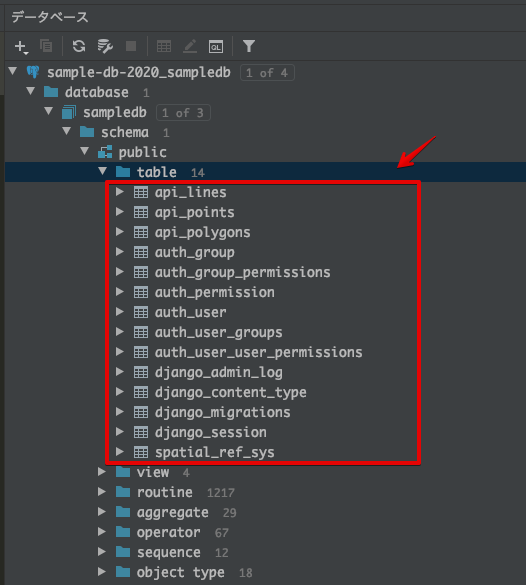

# geodjango-starter


Start GeoDjango easily.  
- [Django v3.0.2](https://www.djangoproject.com)
- [Django REST framework GIS v0.15](https://github.com/openwisp/django-rest-framework-gis)
- [Django Filter v2.2.0](https://django-filter.readthedocs.io/en/master)
- [Psycopg2 Binary v2.8.4](http://initd.org/psycopg)
- [Poetry v1.0.0](https://python-poetry.org)
- [Python v3.8](https://www.python.org)
- Use of [OpenStreetMap](https://www.openstreetmap.org)

<br>

## Usage


<br>

Install database

[PostgreSQL and PostGIS](/app/db)

<br>

Install package

```sh
poetry install
```

<br>

List of package

```sh
poetry show
```

<br>

/app/config/settings.py  

Database settings

```python
DATABASES = {
    'default': {
        'ENGINE': 'django.contrib.gis.db.backends.postgis',
        'NAME': 'sampledb',
        'USER': 'postgres',
        'HOST': 'localhost',
        'PORT': '3306',
        'PASSWORD': '',
    }
}
```

<br>

Migration

```sh
poetry run ./app/manage.py migrate
```



<br>

/app/api/load_points.py  
/app/api/load_lines.py  
/app/api/load_polygons.py  

File path setting of import data

```python
# ファイルパス (GeoJSONのパスを指定)
geojson_file = '/Users/ユーザー/app/db/geojson/point_osm.geojson'

# ファイルパス (GeoJSONのパスを指定)
geojson_file = '/Users/ユーザー/app/db/geojson/line_osm.geojson'

# ファイルパス (GeoJSONのパスを指定)
geojson_file = '/Users/ユーザー/app/db/geojson/polygon_osm.geojson'
```

<br>

Data import

```sh
poetry run ./app/manage.py shell
```

```python
from api import load_points
load_points.run()

from api import load_lines
load_lines.run()

from api import load_polygons
load_polygons.run()

exit()
```

<br>

Confirm import data


<br>

Simple server start

```
poetry run ./app/manage.py runserver
```

<br>

Points data

```
http://127.0.0.1:8000/api/points/100/
```


<br>

Lines data

```
http://127.0.0.1:8000/api/lines/100/
```


<br>

Polygons data

```
http://127.0.0.1:8000/api/polygons/100/
```


<br>

---

<br>

## License
MIT

Copyright (c) 2020 Yasunori Kirimoto

<br>

---

<br>

### Japanese

<br>

# GeoDjango スターター


GeoDjangoを手軽に始める  
- [Django v3.0.2](https://www.djangoproject.com)
- [Django REST framework GIS v0.15](https://github.com/openwisp/django-rest-framework-gis)
- [Django Filter v2.2.0](https://django-filter.readthedocs.io/en/master)
- [Psycopg2 Binary v2.8.4](http://initd.org/psycopg)
- [Poetry v1.0.0](https://python-poetry.org)
- [Python v3.8](https://www.python.org)
- [OpenStreetMap](https://www.openstreetmap.org)データを利用

<br>

##  使用方法


<br>

データベースインストール

[PostgreSQL and PostGIS](/app/db)

<br>

パッケージインストール

```sh
poetry install
```

<br>

パッケージリスト

```sh
poetry show
```
<br>

/app/config/settings.py  

データベースの設定

```python
DATABASES = {
    'default': {
        'ENGINE': 'django.contrib.gis.db.backends.postgis',
        'NAME': 'sampledb',
        'USER': 'postgres',
        'HOST': 'localhost',
        'PORT': '3306',
        'PASSWORD': '',
    }
}
```

<br>

マイグレーション実行

```sh
poetry run ./app/manage.py migrate
```


<br>

/app/api/load_points.py  
/app/api/load_lines.py  
/app/api/load_polygons.py  

インポートデータのファイルパス設定

```python
# ファイルパス (GeoJSONのパスを指定)
geojson_file = '/Users/ユーザー/app/db/geojson/point_osm.geojson'

# ファイルパス (GeoJSONのパスを指定)
geojson_file = '/Users/ユーザー/app/db/geojson/line_osm.geojson'

# ファイルパス (GeoJSONのパスを指定)
geojson_file = '/Users/ユーザー/app/db/geojson/polygon_osm.geojson'
```

<br>

データインポート

```sh
poetry run ./app/manage.py shell
```

```python
from api import load_points
load_points.run()

from api import load_lines
load_lines.run()

from api import load_polygons
load_polygons.run()

exit()
```

<br>

インポートデータ確認


<br>

簡易サーバー起動

```
poetry run ./app/manage.py runserver
```

<br>

ポイントデータ表示

```
http://127.0.0.1:8000/api/points/100/
```


<br>

ラインデータ表示

```
http://127.0.0.1:8000/api/lines/100/
```


<br>

ポリゴンデータ表示

```
http://127.0.0.1:8000/api/polygons/100/
```


<br>

---

<br>

## ライセンス
MIT

Copyright (c) 2020 Yasunori Kirimoto

<br>
