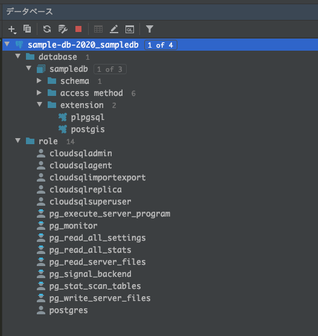

# Install database

### Google Cloud SQL  

- PostgreSQLとPostGISをインストール  
- 課金が発生するので利用は自己責任でお願いします
- ローカル環境やDocker環境でのインストールでも問題ありません

<br>

インスタンス作成


<br>

PostgreSQL選択


<br>

インスタンス設定


<br>

作成されたインスタンス確認


<br>

Cloud Shellに接続


<br>

データベース作成

```sql
CREATE DATABASE sampledb;
```


<br>

コンソールでデータベース確認


<br>

データベース確認

```sql
\l
```


<br>

データベースにPostGIS適用

```sql
\c sampledb
CREATE EXTENSION postgis;
```


<br>

PostGISのバージョン確認

```sql
SELECT postgis_version();
```


<br>

[Cloud SQL Proxy](https://cloud.google.com/sql/docs/postgres/sql-proxy)でデータベースに接続

```sh
./cloud_sql_proxy -instances="instance name"=tcp:3306
```


<br>

データベースツールでデータベースに接続


<br>

データベースの確認



<br>
<br>

## ライセンス
MIT

Copyright (c) 2020 Yasunori Kirimoto

<br>
